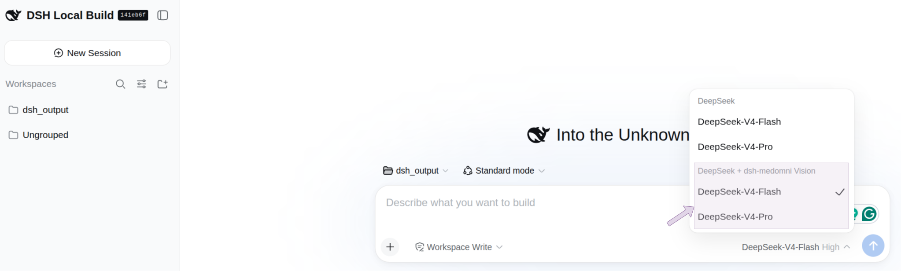

<h1 align="center">DeepSeek Harness × MedOmni: A Composable Agentic Framework for Biomedical Image Analysis</h1>


<p align="center">
  
</p>

<p align="right"><sub><em>Figure preparation assisted by ChatGPT.</em></sub></p>

<p align="center">
  <a href="LICENSE"></a>
  <a href="package.json">=22" /></a>
  <a href="cordis.patch.yml"></a>
  
</p>


## Demo

https://github.com/user-attachments/assets/8a098d95-8d24-44bd-8435-67e52450c524

## Contents

- [What this plugin does](#what-this-plugin-does)
- [Demo](#demo)
- [Requirements](#requirements)
- [Quick start](#quick-start)
- [Enable image input for pasted images](#enable-image-input-for-pasted-images)
- [Usage examples](#usage-examples)
- [Tools](#tools)
- [Adding a new tool](#adding-a-new-tool)
- [Disable / re-enable](#disable--re-enable)
- [Configure](#configure)
- [Troubleshooting](#troubleshooting)
- [Scope](#scope)
- [License](#license)


## What this plugin does

dsh-medomni is a preview implementation of the MedOmni strategy for medical image analysis. It gives a language-model agent a modality-specific set of tools so it can select an appropriate workflow from a natural-language request:

- **Report generation:** Generate candidate reports for chest X-ray, CT, MRI, and retinal images; compare current and prior chest X-rays for interval change.
- **Localization:** Ground suspected chest X-ray findings with evidence boxes, locate named chest X-ray findings, and label normal chest X-ray anatomy.
- **Segmentation:** Generate masks and overlays for prompted findings or structures in X-ray, ultrasound, retinal images, CT NIfTI volumes, and MRI NIfTI volumes; perform fixed-label anatomical segmentation on CT and MRI volumes.
- **Classification:** Classify ultrasound images to support a classification-first workflow before targeted localization.
- **Agent-guided routing:** Select reporting, classification, localization, or segmentation tools from a natural-language request and return structured results with preview images.
- **Input handling:** Paste supported 2D images through the image-enabled provider route or supply them by path. Supply 3D CT/MRI studies by filesystem path; NIfTI is supported by all 3D tools, while DICOM directories are supported by the report and fixed-label segmentation tools.

**Data and network disclosure:** Model inference runs locally on the configured machine. The plugin connects to Hugging Face to download model checkpoints and uses `HF_TOKEN` only for gated model access; the token is read from the process environment and is not stored by the plugin. Input files and generated previews are read from or written to the local filesystem and are retained according to the surrounding DSH session. The behavior of the selected DSH language-model provider is controlled by DSH and its provider configuration, not by this plugin.

## Requirements

Prepare these items before installing the plugin:

- A DeepSeek Harness `dsh` installation.
- **An NVIDIA GPU with CUDA.** CPU mode is available for some tools, but these multi-GB vision-language and segmentation models are generally impractical without a GPU.
- [`uv`](https://docs.astral.sh/uv/), `git`, and Python 3 available on `PATH`. `uv` creates the isolated environment; `git` is used by BiomedParse on its first use.
- Hugging Face access for the gated checkpoints: accept the terms for [MAIRA-2 (`microsoft/maira-2`)](https://huggingface.co/microsoft/maira-2), [BiomedParse (`microsoft/BiomedParse`)](https://huggingface.co/microsoft/BiomedParse), and [MedGemma](https://huggingface.co/google/medgemma-1.5-4b-it). [BiomedCLIP](https://huggingface.co/microsoft/BiomedCLIP-PubMedBERT_256-vit_base_patch16_224) is public.
- A Hugging Face read token. Create one at [Hugging Face settings](https://huggingface.co/settings/tokens), then either run `hf auth login` or export it with `export HF_TOKEN=hf_...`.

No checkpoint needs to be downloaded manually. The required model downloads automatically when its tool is first used. Optional prefetch commands are documented below.

## Quick start

Follow these steps in order.

### 1. Check the prerequisites

Confirm that the required commands are available:

```sh
python3 --version
uv --version
git --version
```

If `uv` is missing, install it using the [official uv instructions](https://docs.astral.sh/uv/getting-started/installation/). Install Python 3 and Git using your operating system's package manager if needed.

### 2. Authenticate with Hugging Face

After accepting the gated-model terms listed in [Requirements](#requirements), authenticate in the same shell or user account that will run DSH:

```sh
hf auth login
```

Alternatively:

```sh
export HF_TOKEN=hf_...
```

### 3. Install the plugin

```sh
dsh plugin --profile web add github:bowang-lab/dsh-medomni
```


This adds `dsh-medomni` to your profile's `package.json` and installs `cordis.patch.yml` (mounting the plugin under id `dsh-medomni`) automatically. Restart `dsh` (or your DSH Desktop/web session) afterward so the new bundle loads.

### 4. Prepare the MedOmni environment

Run the setup command from the profile where the plugin was installed:

```sh
cd ~/.dsh/profiles/web
./node_modules/.bin/dsh-medomni setup
```

This creates the shared Python environment and installs common dependencies. It does not install every model or the BiomedParse extras. Those remain lazy-loaded so users only download what they use.

> [!NOTE]
> **Optional: prefetch checkpoints.** Normal use downloads each required checkpoint automatically on first use. Run one of the following only if you want to download a checkpoint in advance, after authenticating with Hugging Face:

```sh
hf download microsoft/maira-2
hf download microsoft/BiomedParse biomedparse_v1.pt
hf download microsoft/BiomedCLIP-PubMedBERT_256-vit_base_patch16_224
hf download google/medgemma-1.5-4b-it
```

### 5. Ask, in plain text

Nothing needs to be pre-built or downloaded first. Ask your agent something like:

> "Generate a radiology report for this chest X-ray: `/path/to/chest_xray.png`"

and it picks the matching tool itself. The first call for a model/dependency group may still download its checkpoint; BiomedParse also clones its repo and builds `detectron2` on first use. Later calls reuse the downloaded files. Run `dsh-medomni doctor` any time to see setup progress (see [Troubleshooting](#troubleshooting)).

## Enable image input for pasted images

Tools that take a 2D image (X-ray, ultrasound, retinal, and the classification/report tools) also accept a **pasted image** instead of a filesystem path — but only when the selected provider route declares image input.

> [!IMPORTANT]
> **Before pasting an image, open the model selector in the lower-right corner of the chat composer and choose the entry marked "+ dsh-medomni Vision".**
>
> DSH rejects a pasted image on a text-only provider route before any plugin sees it. dsh-medomni therefore adds an image-enabled route for 2D medical images, which appears as "DeepSeek + dsh-medomni Vision" in the picker. Select this route (as shown in the below image), then paste normally.

<p align="center">
  
</p>

*Select the provider entry marked `+ dsh-medomni Vision` before pasting a 2D medical image.*

The image-enabled route uses the same provider, model, and language model as the original route; it is not a second model. Its adapter changes the pasted image into an attachment identifier that the language model can pass to a dsh-medomni tool. The tool resolves that identifier to the image bytes and runs the selected medical-imaging model.

> [!IMPORTANT]
> **3D CT and MRI inputs must be provided as filesystem paths** to a NIfTI volume or DICOM directory. Pasted-image input is supported only for the plugin's 2D image tools; it does not apply to CT/MRI volume tools.

Set `wrapProviders: false` in the plugin config to disable these image-enabled routes (see [Configure](#configure)).

## Usage examples

**Chest X-ray report:**
> "Generate a radiology report for this chest X-ray: `/path/to/chest_xray.png`"

calls `xray_report_medgemma`, `xray_report_maira`, or `xray_grounded_report_maira` when finding evidence/bounding boxes are useful.

**Find something specific, by name, on any of the five modalities:**
> "Segment the gallstone in this ultrasound image."
> "Are there any microaneurysms in this fundus photo?"

calls the matching `_segmentation_biomedparse` tool only when you ask for segmentation, masks, overlays, or localization. BiomedParse takes any free-text finding or anatomical structure, but its mask is localization, not diagnosis.

**Disambiguate a vague ultrasound request first:**
> "What's in this ultrasound before you segment anything?"

calls `ultrasound_classify_biomedclip` to narrow down anatomy/pathology, then a segmentation tool with the winning label as the prompt.

**Whole-body organ segmentation on a CT or MRI volume:**
> "Segment the liver and kidneys in this CT scan: `/path/to/scan.nii.gz`"

calls `ct_segmentation_totalseg` for the fixed anatomical-structure list, or `ct_segmentation_biomedparse` if you'd rather name a pathology than an organ.

**Prior-vs-current comparison:**
> "Compare this current chest X-ray to the prior one and describe interval change."

calls `xray_longitudinal_comparison` with both images.

## Tools

<p align="center">
  
</p>

## Adding a new tool

New tools should follow the existing pattern: a Python script under `skills/<modality>/`, a `SCRIPTS` entry plus `defineTool` registration in `index.js`, explicit agent-facing instructions in the tool `description`, optional preview attachment support, and package/test updates.

See [Adding a New Tool](ADDING_TOOLS.md) for the full step-by-step checklist and examples.

## Modality skills

dsh-medomni registers these modality workflows as model-invocable DSH skills. The agent can load the relevant skill when a request requires modality-specific tool sequencing; the existing tool descriptions remain the direct tool-selection contract.

- [Chest X-ray](skills/xray/SKILL.md)
- [CT](skills/ct/SKILL.md)
- [MRI](skills/mri/SKILL.md)
- [Ultrasound](skills/ultrasound/SKILL.md)
- [Retinal imaging](skills/retinal/SKILL.md)

## Disable / re-enable

```yaml
- id: dsh-medomni
  disabled: true
```

Set it back to `false` (or remove the line) to re-enable. Unloading removes the tools, the image-enabled routes, and the settings surface; anything already written to the session workspace remains.

## Configure

Nothing is required — the plugin defaults to the `skills/` directory shipped inside this package. Override only if you want to point at a different copy of these scripts, in your profile's `cordis.patch.yml`:

```yaml
- upsert:
    - id: dsh-medomni
      config:
        skillsDir: /path/to/other/skills   # optional, default: this package's own skills/
        # pythonBin: python3               # optional, default "python3"
        # timeoutMs: 1800000                # optional, default 30 minutes
        # wrapProviders: true              # optional, default true — adds image-enabled
        #                                  #   "<provider>-dsh-medomni" routes
        # excludedProviders: []            # optional — provider ids never wrapped
```

## Troubleshooting

`dsh-medomni doctor` checks this machine's setup without calling any model — whether `uv`/`git`/`python3` are on `PATH`, whether the shared venv exists, and how far BiomedParse's one-time setup has progressed:

```sh
cd ~/.dsh/profiles/web
./node_modules/.bin/dsh-medomni doctor
```

or, against a local checkout of this repo directly:

```sh
node /path/to/dsh-medomni/lib/doctor-cli.js
```

```
skills/: /path/to/dsh-medomni/skills
✓ uv — uv 0.10.7
✓ git — git version 2.34.1
✓ python3 — Python 3.12.12

✓ shared venv
    torch pin: torch==2.10.0
    torch 2.10.0+cu128, CUDA available: true

✓ BiomedParse repo cloned
✓ BiomedParse extra dependencies installed
✓ detectron2 built
✓ BiomedParse weights downloaded — 1.7GB
```

A `✗` line names exactly what's missing and why it matters. An unchecked BiomedParse line is not itself an error — that stage only runs on a `_biomedparse` tool's first call — but is the first place to look if such a call fails. Pass `--skills-dir <path>` if your profile overrides the plugin's default `skillsDir`.

## Scope

- This is the preview release of MedOmni and its tool strategy, not a general registry of every medical-imaging model family. Only tools that follow the MedOmni tool protocol are included: each tool declares its contract in `index.js`, uses the standard execution path, returns structured JSON, and bootstraps an isolated Python environment before importing model dependencies.
- Other model families and tools that do not follow this protocol are intentionally excluded from this preview. For example, some tube/line detection and bone-fracture tools have backing scripts with no isolated-venv bootstrap of their own. They import bare `torch`/`transformers` from whatever ambient Python environment happens to be active, which can silently conflict with a pinned range such as MAIRA-2's `transformers>=4.48,<4.52`.

If you want to add tools back in this style, follow [Adding a New Tool](ADDING_TOOLS.md): a `SCRIPTS` entry pointing at a script under `skills/<modality>/`, a matching `defineTool` registration whose `execute` shells out to it and parses its JSON stdout, explicit agent-facing tool instructions, and `skills/_bootstrap.py`'s bootstrap at the top of the script.

## License

[MIT](LICENSE)
